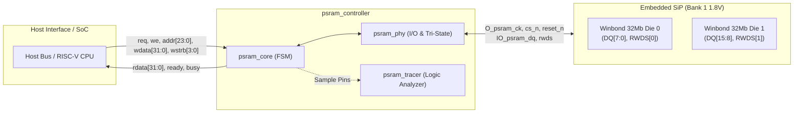
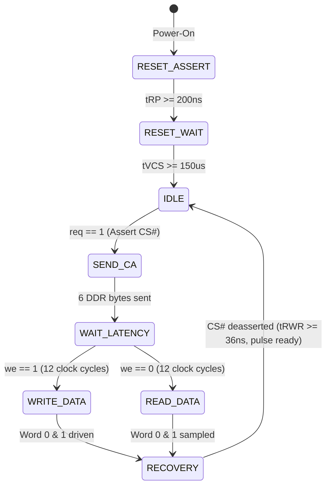

# Tang Nano 9K PSRAM Controller

[](LICENSE)
[](https://wiki.sipeed.com/hardware/en/tang/Tang-Nano-9K/Nano-9K.html)
[](https://veryl-lang.org/)
[](https://github.com/YosysHQ/oss-cad-suite-build)
[](#simulation)
[](#hardware-verification)

A clean-room, robust **HyperBus PSRAM Controller** designed for the **Winbond W955D8MBYA** 64Mbit (8MB) PSRAM embedded inside the Gowin GW1NR-9C FPGA on the **Tang Nano 9K** development board.

Written in modern **Veryl HDL**, synthesized with **Yosys**, placed and routed with **nextpnr-himbaechel**, and fully verified both in RTL simulation (**Icarus Verilog**) and on real silicon.

---

## Key Highlights

- **16-bit DDR Data Bus**: Operates the two internal 32Mb x8 dies in lockstep for 16-bit wide DDR data transfers (27 MT/s at 27 MHz system clock).
- **Center-Aligned Clocking**: PSRAM CK is registered on `negedge clk`, creating an exact quarter-cycle (18.5 ns) phase shift that provides generous setup and hold margins without complex PLLs or DLLs.
- **Fixed Latency Mode**: Operates at 2x Fixed Latency (12 PSRAM clock cycles / 24 system cycles), supporting deterministic read and write transactions.
- **Clean-Room Specification**: Developed strictly from official vendor datasheets (Winbond & Gowin) without proprietary IP dependencies.
- **Built-in Real-Time Pin Tracer**: Includes an on-chip logic analyzer (`psram_tracer`) that records 64 cycles of physical pin states (CS#, CK, OE, RWDS, DQ, FSM State, Timer) and prints them via UART for instant hardware diagnostics.
- **100% Open-Source Toolchain**: Fully reproducible using `veryl`, `yosys`, `nextpnr`, `apycula`, `openFPGALoader`, and `iverilog`.
- **SRAM-Only Safety**: Hardware verification runs entirely in volatile FPGA SRAM (`openFPGALoader -b tangnano9k pack.fs`), protecting the on-board SPI Flash memory from wear.

---

## Architecture Overview



### Finite State Machine (FSM)



---

## Hardware Pinout (GW1NR-LV9 QFN88P)

The two 32Mbit x8 PSRAM dies are packaged in SiP and internally bonded to FPGA Bank 1 IOBs:

| Signal | Dir | IOB | Tang Nano 9K Internal Function |
|---|---|---|---|
| `O_psram_ck[0]` / `ck[1]` | Out | `IOL8A` / `IOL23B` | Differential Clock (+) for Die 0 / Die 1 |
| `O_psram_ck_n[0]` / `ck_n[1]` | Out | `IOL7A` / `IOL23A` | Differential Clock (-) for Die 0 / Die 1 |
| `O_psram_cs_n[0]` / `cs_n[1]` | Out | `IOL6B` / `IOL22A` | Chip Select (Active-Low) for Die 0 / Die 1 |
| `O_psram_reset_n[0]` / `reset_n[1]` | Out | `IOL2A` / `IOL18A` | Hardware Reset (Active-Low) |
| `IO_psram_rwds[0]` / `rwds[1]` | Inout | `IOL17A` / `IOL27B` | Read Strobe / Write Byte Mask for Die 0 / Die 1 |
| `IO_psram_dq[7:0]` | Inout | `IOL2B..IOL17B` | 8-bit DDR Data Bus for Die 0 |
| `IO_psram_dq[15:8]` | Inout | `IOL18B..IOL27A` | 8-bit DDR Data Bus for Die 1 |

*Complete pin mappings are specified in [`tangnano9k.cst`](demo/tangnano9k/tangnano9k.cst) and documented in [`docs/spec.md`](docs/spec.md).*

---

## Directory Structure

```text
├── Makefile                   # Veryl, Icarus, Yosys, nextpnr, test-hw automation
├── Veryl.toml                 # Veryl project of the controller IP (rtl/ only)
├── rtl/                       # Controller IP
│   ├── psram_pkg.veryl        # Timing parameters & constants
│   ├── psram_core.veryl       # HyperBus protocol FSM
│   ├── psram_phy.veryl        # Physical layer tri-state & center-aligned clock IO
│   └── psram_controller.veryl # Top controller wrapper
├── sim/
│   └── model/
│       └── tb_psram_model.sv  # W955D8MBYA behavioral simulation model
├── demo/tangnano9k/           # Board demo (separate Veryl project using the IP)
│   ├── Veryl.toml             # Depends on the IP via `psram = { path = "../.." }`
│   ├── psram_top.veryl        # Self-test diagnostic top module with UART & LED
│   ├── psram_tracer.veryl     # 64-sample on-chip logic analyzer
│   ├── uart/                  # UART transmitter & receiver
│   ├── tb_psram_top.sv        # Demo smoke-test testbench
│   ├── tangnano9k.cst         # Gowin physical pin constraint file
│   └── run_hardware_test.py   # Hardware UART monitor & pin trace analyzer
└── docs/
    └── spec.md                # Technical design specification
```

Generated SystemVerilog is not committed. `make veryl` / `make veryl-demo` write it under `build/`
(invoked automatically by `make sim-demo` / `make bitstream`). Projects using the IP as a Veryl
dependency see its modules with the dependency name as prefix (e.g. `psram_psram_controller`).

---

## Quick Start Guide

### Prerequisites

Install the open-source FPGA toolchain:
- **[Veryl](https://veryl-lang.org/)** (v0.21+): Modern HDL compiler
- **[OSS CAD Suite](https://github.com/YosysHQ/oss-cad-suite-build)** (includes Yosys, nextpnr-himbaechel, Apycula, openFPGALoader, and Icarus Verilog)
- **Python 3** (with `pyserial`)

### 1. Run RTL Simulation

```bash
make sim-demo
```

This compiles the Veryl sources to SystemVerilog, compiles the testbench with Icarus Verilog, and runs the test against the clean-room W955D8MBYA simulation model.

Expected output:
```text
=== Starting PSRAM Controller Simulation ===
[TB] Reset de-asserted. Waiting for power-up initialization (150us)...
=== PSRAM TRACE (ID0) ===
...
=== END TRACE ===
[PSRAM] TEST PASSED! 64Mb OK
[TB] SUCCESS: All LEDs ON -> PSRAM verification passed!
```

### 2. Build FPGA Bitstream

Synthesize with Yosys, place-and-route with nextpnr, and pack with `gowin_pack`:

```bash
make bitstream
```

Generated artifacts will be placed in `build/demo/synth/pack.fs`.

### 3. Run Hardware Verification

Connect the Tang Nano 9K board via USB and run:

```bash
make test-hw
```

This command:
1. Programs `pack.fs` directly into the FPGA **SRAM** (volatile; never touches SPI Flash).
2. Listens to the USB serial port (`/dev/ttyUSB3` by default at 115200 baud; override with `make test-hw SERIAL_PORT=/dev/ttyUSBx`).
3. Automatically parses the real-time logic analyzer trace and verifies the memory read/write patterns.

Example hardware output:
```text
=== FPGA configured! Listening for PSRAM test output... ===
=== PSRAM TRACE (ID0) ===
CYC: S TM C K OE RW D1 D0
C00: 2 00 1 0 0 11 FF FF
C01: 3 00 0 0 1 11 E0 E0
...
C1E: 4 16 0 1 0 11 00 00
C1F: 6 00 0 0 0 00 5F 5F
...
=== END TRACE ===

[PSRAM] TEST PASSED! 64Mb OK

=================================================================
            REAL-TIME PIN TRACE ANALYSIS REPORT
=================================================================
[*] CHIP RESPONSE DETECTED! First response at cycle 8
[+] Winbond PSRAM ID0 match confirmed (0x5F / Winbond 32Mb die)!
[*] RWDS was driven High for 26 cycles (indicates 2x Fixed Latency mode).
=================================================================
>>> SUCCESS: PSRAM Hardware Read/Write Test PASSED on Tang Nano 9K! <<<
```

---

## Host Bus Interface Specification

`psram_controller` has a valid/ready request channel and a one-cycle response. Parameter
`CLK_HZ` (default 27 MHz) is the system clock frequency; the PSRAM clock is `CLK_HZ / 2`.
The tests run at 18 MHz (VUX9K) and 27 MHz (this board).

| Port | Direction | Width | Description |
|---|---|---|---|
| `clk` | Input | 1 | System clock (`CLK_HZ`) |
| `rst_n` | Input | 1 | Active-Low asynchronous reset |
| `req_valid` | Input | 1 | Request valid; hold (with the payload unchanged) until accepted |
| `req_ready` | Output | 1 | Request accepted in a cycle with `req_valid && req_ready` |
| `req_we` | Input | 1 | `1`: write, `0`: read |
| `req_addr` | Input | 24 | Byte address, 4-byte aligned (bit 23: `0` = memory, `1` = register space) |
| `req_wdata` | Input | 32 | Write data |
| `req_wstrb` | Input | 4 | Byte enables for memory writes |
| `rsp_valid` | Output | 1 | One-cycle response, exactly one per accepted request |
| `rsp_rdata` | Output | 32 | Read data, valid with `rsp_valid` |
| `init_done` | Output | 1 | PSRAM power-up sequence finished (`req_ready` is Low until then) |
| `dbg_sample` | Output | 32 | FSM/pin state for an on-chip tracer; leave unconnected if unused |

One request is in flight at a time; `req_ready` is High again in the cycle of `rsp_valid`,
so the next request can be accepted back-to-back. Register space: ID0 `0x800000`,
ID1 `0x800004`, CR0 `0x800020`, CR1 `0x800024` (a register write loads `wdata[7:0]`/`[23:16]`
into die 0 and `wdata[15:8]`/`[31:24]` into die 1).

---|---|---|---|
| `clk` | Input | 1 | 27 MHz system clock |
| `rst_n` | Input | 1 | Active-Low asynchronous reset |
| `req` | Input | 1 | Access request pulse (assert for 1 cycle) |
| `we` | Input | 1 | `1`: Write, `0`: Read |
| `addr` | Input | 24 | Byte address (bit 23: `0` = Memory Space, `1` = Register Space) |
| `wdata` | Input | 32 | 32-bit write word |
| `wstrb` | Input | 4 | Byte write masks (`1`: write byte, `0`: mask) |
| `rdata` | Output | 32 | 32-bit read word (valid when `ready` pulses) |
| `ready` | Output | 1 | 1-cycle completion pulse |
| `busy` | Output | 1 | High while a transaction is in progress |

---

## License

This project is licensed under the **MIT License** - see the [LICENSE](LICENSE) file for details.
